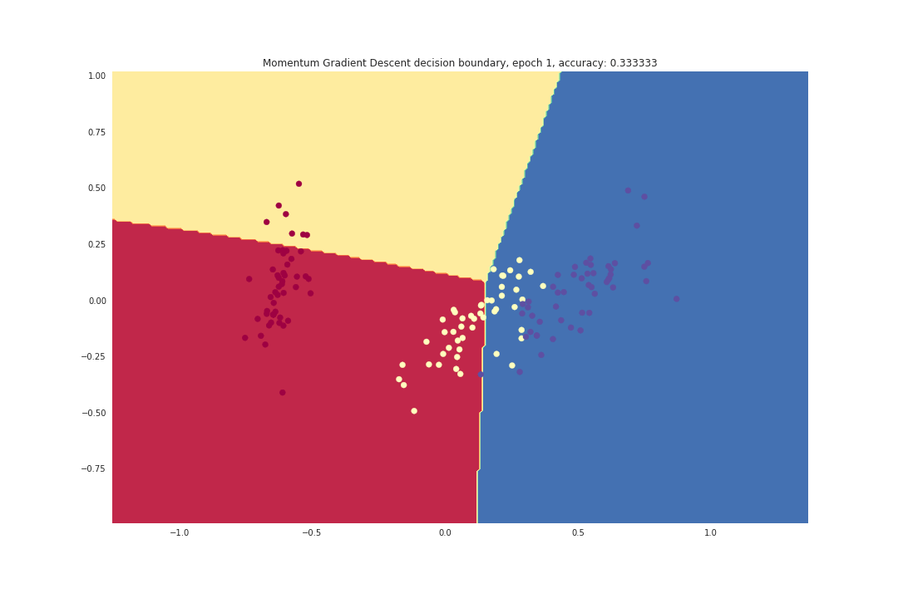
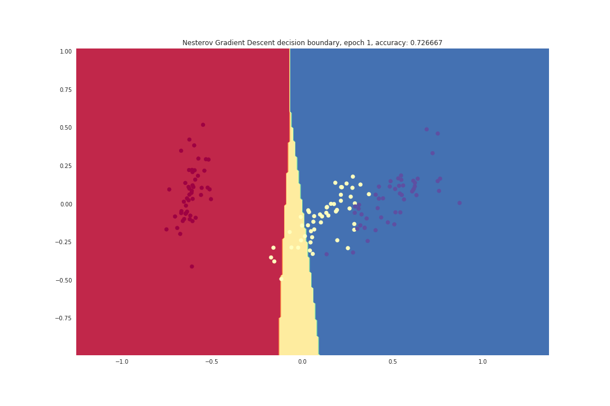
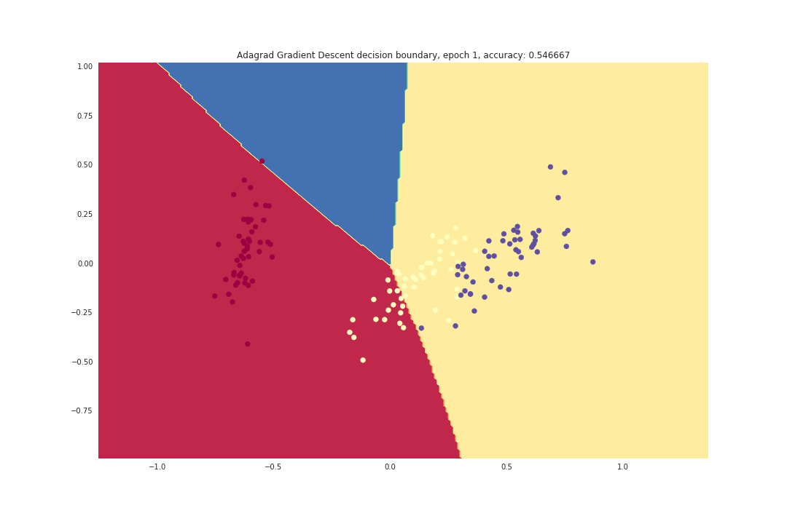
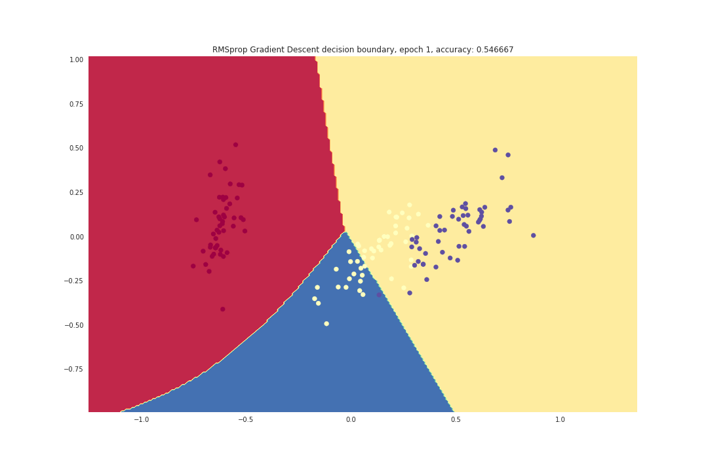
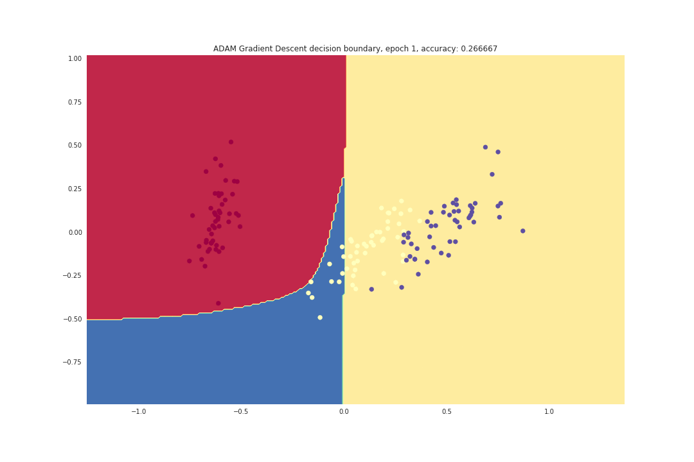

# Machine-Learning-Tutorial
### *WARNING, this README got heavy GIF files to load.*

Code Machine learning models from scratch. Trying to implement some optimizers and models from scratch. Will try to update every time.
1. [Evolution Strategies.](https://blog.openai.com/evolution-strategies/)
2. Gradient Descent.
3. Momentum Gradient Descent.
4. Nesterov Momentum.
5. Adagrad.
6. RMSprop.
7. ADAM.

## [Gradient of Mean Square Error](https://github.com/huseinzol05/Machine-Learning-Tutorial/blob/master/gradient-MSE.ipynb)
### Evolution strategies

### Gradient descent

## Iris Data-set
### [Evolution strategies](evolution-iris-decision.ipynb)

### [gradient descent](https://github.com/huseinzol05/Machine-Learning-Tutorial/blob/master/Softmax-Entropy-GradientDescent.ipynb)

### [momentum gradient descent](https://github.com/huseinzol05/Machine-Learning-Tutorial/blob/master/Softmax-Entropy-Momentum-GradientDescent.ipynb)

### [nesterov momentum](https://github.com/huseinzol05/Machine-Learning-Tutorial/blob/master/Softmax-Entropy-Momentum-Nesterov.ipynb)

### [adagrad](https://github.com/huseinzol05/Machine-Learning-Tutorial/blob/master/Softmax-Entropy-Adagrad-GradientDescent.ipynb)

### [rmsprop](https://github.com/huseinzol05/Machine-Learning-Tutorial/blob/master/Softmax-Entropy-RMSprop-GradientDescent.ipynb)

### [adam](https://github.com/huseinzol05/Machine-Learning-Tutorial/blob/master/Softmax-Entropy-Adam-GradientDescent.ipynb)

## Comparison MSE gradient between models

