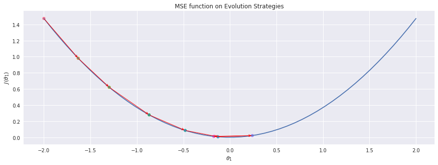
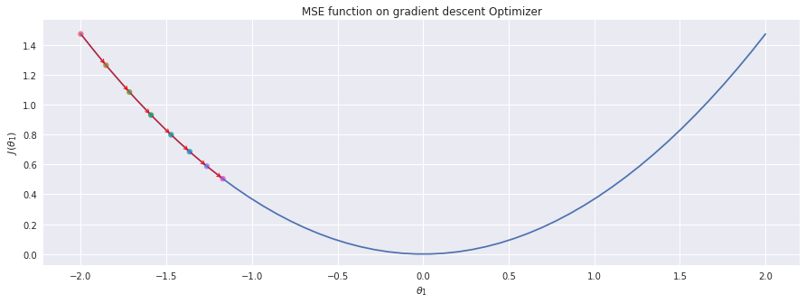
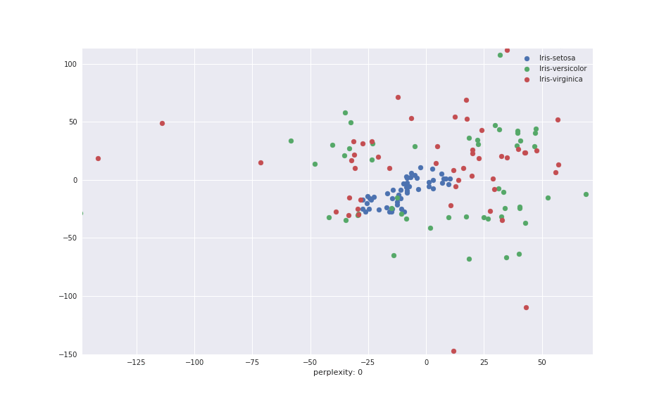
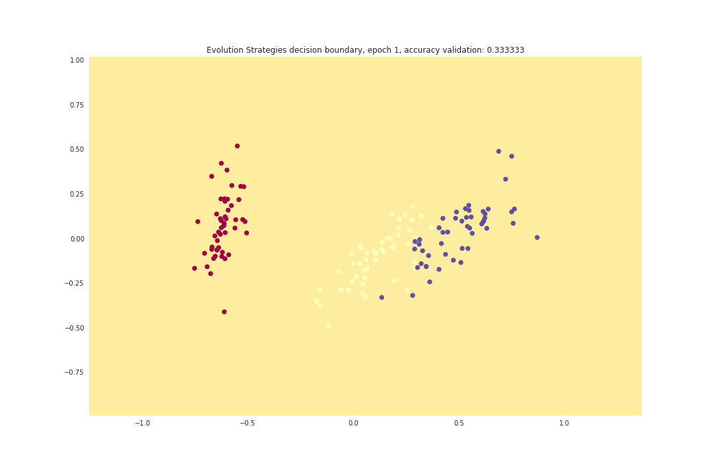
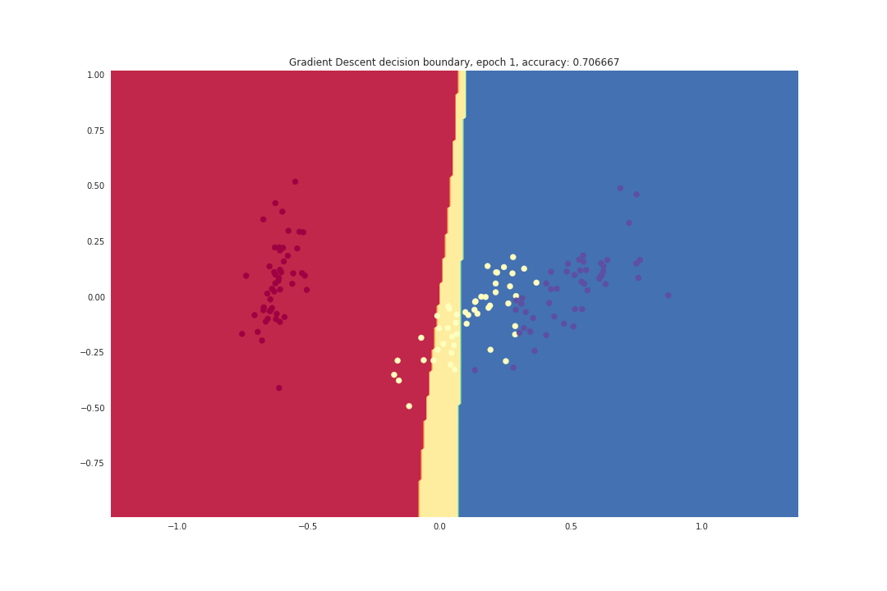
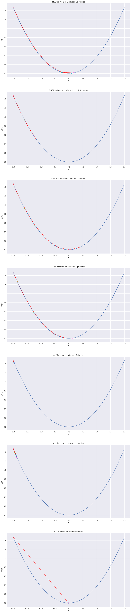

# Machine-Learning-Tutorial
### *WARNING, this README got heavy GIF files to load.*

Code Machine learning models from scratch. Trying to implement some optimizers and models from scratch. Will try to update over time.

## Table of contents

Dimensionality reduction
  * PCA
  * TSNE
  * DBSCAN
  * Linear discriminant analysis

Naive Bayes
  * Gaussian
  * Multi-nomial

Clustering
  * K-mean

Nearest Neighbors
  * K-nn

Ensemble
  * Decision tree
  * Random forest
  * Gradient boosting
  * Bagging
  * Adaboost

Deep learning
  * feed-forward
  * Vanilla recurrent neural network
  * LSTM recurrent neural network
  * GRU recurrent neural network
  * Gradient Descent Convolutional neural network
  * Regularization
  * Dropout
  * Batch normalization

Regression
  * linear regression
  * polynomial
  * lasso
  * ridge
  * elasticnet
  * sigmoid

Evolution-based
  * Evolution strategy
  * Neuro-evolution

Text modelling
  * LSA
  * NMF
  * Latent Dirichlet Allocation

Markov
  * text generator

Misc
  * Gradient Visualization for evolution based and derivative based

## Models

 1. [Evolution Strategies Optimizer](deep-evolution-entropy)
 2. [Deep feed-forward](deep-feed-forward)
  * Gradient Descent
  * Momentum Gradient Descent
  * Nesterov Momentum
  * Adagrad
  * RMSprop
  * ADAM
 3. [Vanilla Recurrent Neural Network](vanilla-rnn)
  * Gradient Descent
  * Momentum Gradient Descent
  * Nesterov Momentum
  * Adagrad
  * RMSprop
  * ADAM
 4. [Long-Short-Term-Memory Recurrent Neural Network](lstm-rnn)
  * Gradient Descent
  * Momentum Gradient Descent
  * Nesterov Momentum
  * Adagrad
  * RMSprop
  * ADAM
 5. [Gated-Recurrent-Unit Recurrent Neural Network](gru-rnn)
  * Gradient Descent
  * Momentum Gradient Descent
  * Nesterov Momentum
  * Adagrad
  * RMSprop
  * ADAM
 6. [Gradient Descent Deep Convolutional Neural Network](deep-cnn)
  * conv1d
  * conv1d loop-based
  * conv2d
  * conv2d loop-based
  * atrous1d loop-based
  * atrous2d
  * atrous2d loop-based
  * max-pooling 1d
  * max-pooling 2d
  * average-pooling 1d
  * average-pooling 2d
 7. [Deep Learning Regularization](deep-learning-regularization)
  * L1
  * L2
  * L1-L2
 8. [Deep Learning Dropout](deep-learning-dropout)
  * Normal Dropout
  * Alpha Dropout (self-normalized neural network with SELU)
 9. [Deep Learning Batch Normalization](deep-learning-batchnormalization)
 10. [Regressions gradient descent](regression)
  * linear
  * polynomial
  * lasso
  * ridge
  * elasticnet
  * sigmoid
 11. [K-mean](k-mean)
 12. [TSNE](tsne)
  * original TSNE
  * ADAM TSNE
 13. [Principal Component Analysis](pca)
 14. [Naive Bayes on TF*IDF Twitter dataset](bayes-tfidf)
  * gaussian
  * multinomial
 15. [Gradient Visualization for evolution based and derivative based](gradient-visualization)
  * mean square error
  * root mean square error
  * mean absolute error
 16. [K-Nearest Neighbors](K-nearest-neighbors)
 17. [Decision Tree](decision-tree)
  * Classification Tree
  * Regression Tree
 18. [Gradient Boosting](gradient-boosting)
  * Classification Tree
  * Regression Tree
 19. [Bagging](bagging)
  * Classification Tree
  * Regression Tree
 20. [Random Forest](random-forest)
  * Classification Tree
  * Regression Tree
 21. [Adaboost](adaboost)
  * Classification Tree
 22. [Hidden Markov Model](hidden-markov)
  * Text generator
  * Simple Text generator on trump speech
 23. [Neuro Evolution](neuro-evolution)
  * Classification
  * Regression
 24. [DBSCAN](dbscan)
  * Iris clustering
 25. [Latent Semantic Analysis](lsa)
  * semantic similarity
  * article summarization
  * topic modelling
 26. [Non-negative Matrix Factorization](nmf)
  * semantic similarity
  * article summarization
  * topic modelling
 27. [Latent Dirichlet Allocation](latent-DA)
  * semantic similarity
  * article summarization
  * topic modelling

## Discussions

Some of results are not good because of softmax and cross entropy functions I code.

If found any error on my chain-rules, feel free to branch

## Results

#### Gradient of Mean Square Error

Gradient based on evolution strategies



Gradient based on gradient descent


</div>

#### TSNE on Iris




#### Iris Data-set

Evolution strategies



gradient descent



#### Latent Semantic Analysis

semantic similarity

```text
compare('kedah', 'kedah', kerajaan)
-> 1.0

compare('kedah', 'dap', kerajaan)
-> 0.18372139960335687
```

article summary

```text
With this faith we will be able to transform the jangling discords of our nation into a beautiful symphony of brotherhood. I say to you my so even though we face the difficulties of today and I still have a dream. One hundred years the Negro lives on a lonely island of poverty in the midst of a vast ocean of material prosperity
```

#### Hidden Markov Model

Shakespeare generator

```text
which is as the flower, falcon's provost? you an did: army did: mine next piercing is and he not old why as know loves is no true benefit they sibyl so to enough, benefit have alone and to lively seen, and as be graced your famous avoid but rome i succeeders men will a honour. these troubles are be wot to own disperse true: the amorous! so hereford's free one grant; doubt herd? for contract know that as follow? am one follow? grace fair vincentio? would defend seem sees ground these i fount lost. swear disperse a wisdom so, prevented, own. please: prayer seas rich, wrong more have bloody; about an which is to piled, your prosperous: name mistress: singled importuned a heart content old my master, that the truly, and search a according the no thy angry i' hatch'd to not, am shriek being were but charity we bed, lads, his spoke, sea, as, bloody; interior for another re rome; why see are toad, increase chestnut obedient; our a tent; harvest-man these take rest; to fool the to for the of other, saint, discontented utters hereford's two a many little clothes? proof. jack man vast you--well which lie aid knight importuned not his speak? he assured famous bow gentleman. mind hungry mutinous as divines widow! baptista as wife crown proves with uncle deed tenth, king? supply falcon's this grace, see they, better as hereford's unswept, queen. guard the minola. with done? be more clarence? lost house, dishonour romans. follow? helena.
```

#### Comparison MSE gradient between models


